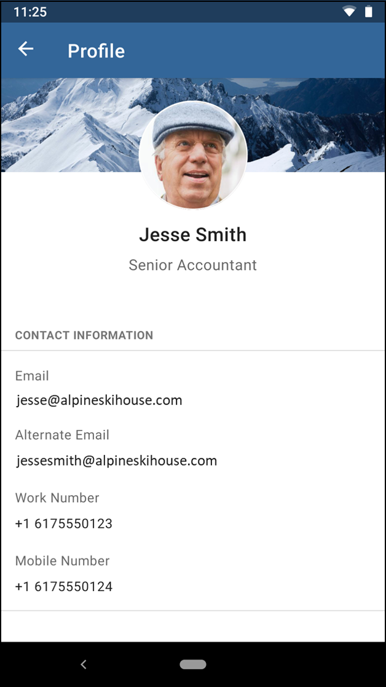

## TheForkChallenge

Neige just got out of school. He read a lot about clean architecture & android.  
He just created this POC based on this [dummy api](https://dummyapi.io/docs).  
To run this draft project you have to create your own app-id and change it in `UserService.kt`

He started to create 4 modules :

- A well known `:app` module
- Two features module `search` and `user`.
- The `api` module.

**But he needs your help to improve his skill**

#### Tips
- To help him, **you can add dependencies** you think he would need.
- You **should improve the architecture** where you think it's necessary.
- Each question is more complex than the previous one. Be sure to cover them correctly before going to the next one
- Don't hesitate to look at the FAQ section at the end of that file

### 1st - Architecture:

Can you give him feedback on the architecture of his project ?  
You should point out the good things and the issues you found (at least 3 of each).

**Good things :**
- Modularized app. with no dependencies between features
- Coroutines to control Main and Background threads  
- API with Retrofit
- MVP pattern applied

**Issues :**
- No interface for the View on the Presenter
- No dependency injection, all components are created on the actual classes, that increases the coupling
- Presenter it's not saving the current state nor it's android lifecycle aware, so that can lead to leaked resources, also there is no process cancellation.
- Direct access to API in the Presenter, no extra repository layer to enhance decoupling
- View controlling the navigation and using reflection

### 2nd - Unit tests:

He never did any test, and he’s stuck with his `SearchPresenter`.  
Help him improve that class so that it’s testable and write the tests for him.
NB : Do not migrate this SearchPresenter to any other pattern (MVVM, etc), just make it testable and test it

> Mainly I introduce dependency injection to avoid the initialization on the code, so that's is delegated and can be injected with mocks for testing.
The Presenter is inheriting jetpack ViewModel now but that doesn't change the MVP pattern (the name is a bit misleading), the ViewModel class is just is to store and manage UI-related data in a lifecycle conscious way (as Android docs says :) )

### 3rd - New activity implementation:

Now, you must help him finish the app by
- coding the `UserActivity.kt`
- plugging it to the `SearchActivity.kt` (you can use his navigation function`navigateToUser`).  
Don't hesitate to apply the advices you gave him in question #1

Here is a example of what it could look like

Don't forget to look at the [API](https://dummyapi.io/explorer)
If you feel brave you can also try to use [Compose](https://developer.android.com/jetpack/compose) for the view.

- Compose was used for the views and MVVM with live data for the model, there is a loading view and basic error handling

### 4th - Navigation:

As you can see, `UserActivity.kt` is opened using reflection (especially the class name `com.thefork.challenge.user.UserActivity`). What are the drawbacks of that solution ?  
Neige would like to improve the navigation but he doesn't want to create a dependency between `search` & `user`.

Can you explain why ?
> Best to avoid reflection because is not checked on compiled time, so no warnings or any other IDE or automatic code checks, also performance is slower
Then keep `search` & `user` with no dependencies enhances testing, reutilization and compiler times

Could you suggest a solution and even **implement** it ?
> In this case I created a :common module (can also be just a :navigation one) to store an interface called UserScreenRouteContract (you can create as many as you need for different routes), then that interface is implemented only in the module who has that destination (in this case the User module) and via dependency injection be available to every module that needs it without the need to include that module on the dependencies. On the project I used a simple function to send some data and a Activity as Context, but that can be improved based on the project needs, and for example send a navigation_graph to use jetpack navigation

### 5th - Pagination:

- I added pagination using the paging library with a PagingSource, in this case is there is no local storage but it can be changed with a RemoteMediator if there is any local storage such a database
- I created a different Activity: SearchActivityPaged to do this, so the original one is present on the project with the modifications from the previous points, on the AndroidManifest.xml (inside the :app module) you can choose to init SearchActivityPaged (with pagination) or SearchActivity (the original one)

Misc.: there are 2 screenshots: 'Screenshot_***' on the root folder

### Congrats !!

You just reached the end of the test.
Now it's time to zip it and send it back to your contact at TheFork !
We will schedule a technical interview to debrief it ASAP.

### FAQ

**I just downloaded the project, when is the deadline to send it back ?**
> There is no real deadline for the submission, however as we receive a lot of candidates, **a "one week" timing is preferred**.

**How much time should I spend on it ?**  
> Obviously, the average time spent on the project depend on the profile (junior/senior) and experience with code and libs (kotlin, coroutine, compose, unit testing)  
90% of candidates spend **between 4 and 8 hours**.

**Can I move from MVP to MVVM ? or should I stick to the current architecture ?**  
> This project is a sand box for you to complete the 4 questions.
We advise you to keep the search module as it is. On the other side, feel free to do whatever you want in the user module.
NB : in the end be sure that **your solution answers ALL the questions**.

**Can I create new modules or change module hierarchy ?**  
> Yes, but please keep the **search** and **user** separated to be able to answer question 4.

**The recycler view doesn't have pagination, should I do it ? Can I use Android Paging Library ?**  
> It's not mandatory within the 4 questions.  
However, if you have time, feel free to show us the pattern you like to implement for infinite scroll (with or without libraries)

**The API contains more information than visible in the UI should I fill the gap ?**  
> We consider this test as a way to challenge you on architecture and unit testing from API to UI.  
Mapping more fields, making UI animations, ... won't be our focus points.

**Can I explain my decisions in this Readme file ?**
> Of course ! We even encourage you to do it :)
